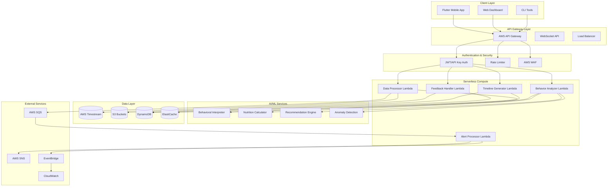
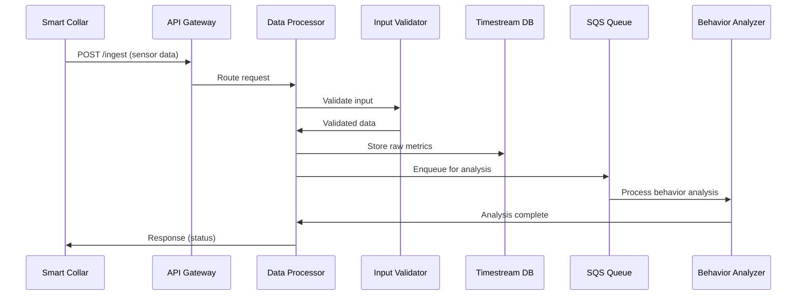
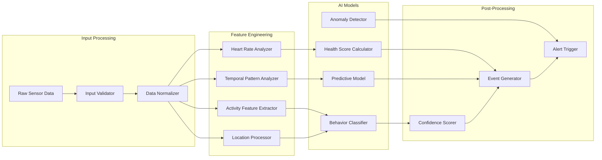
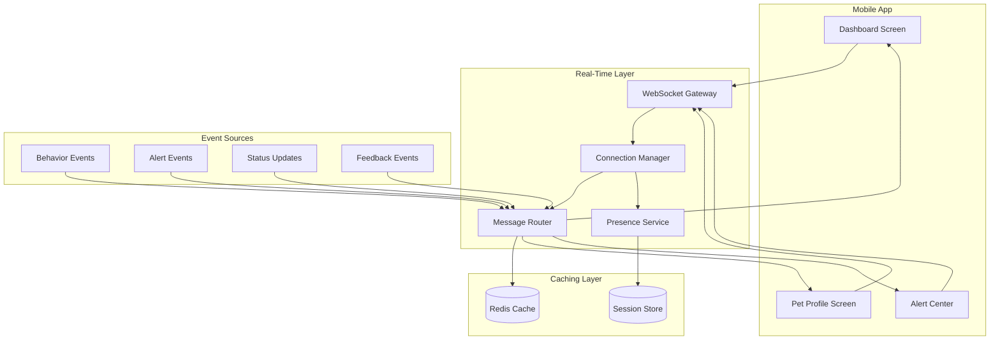
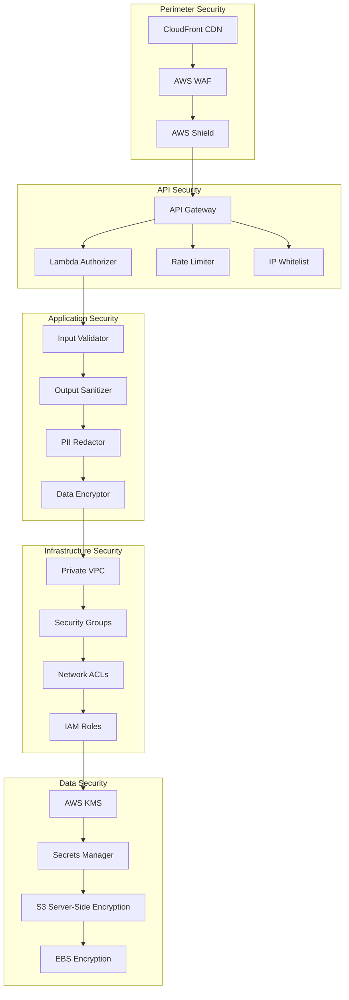
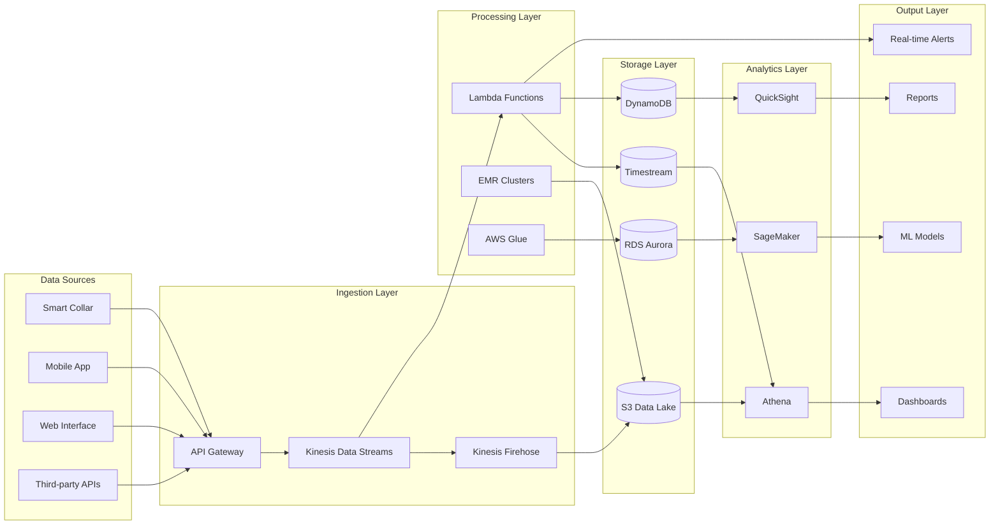
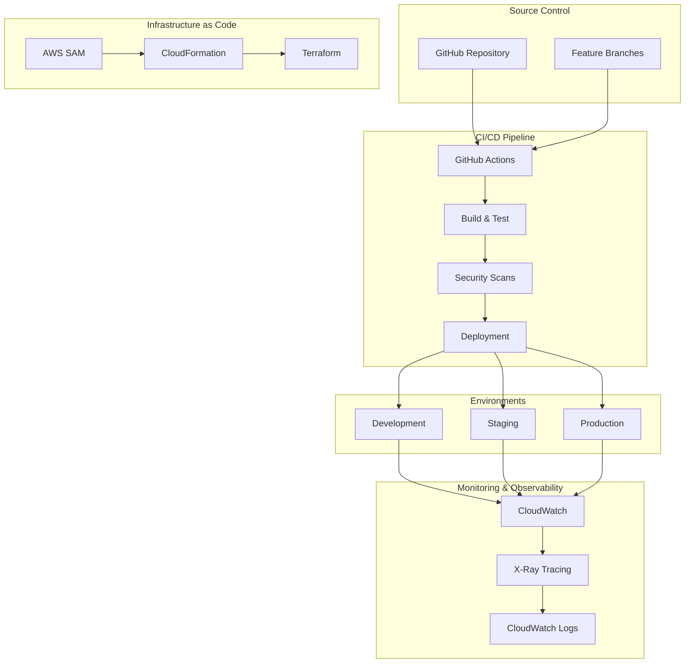
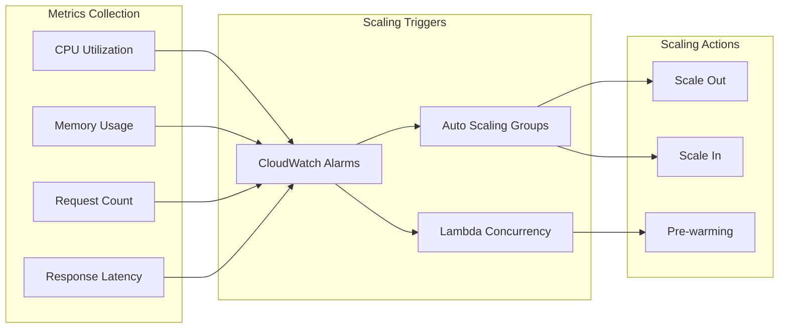
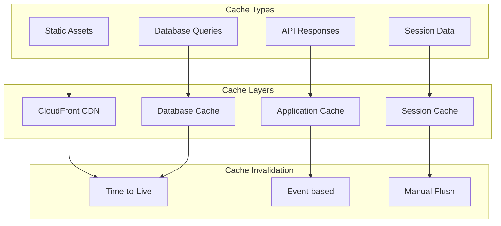
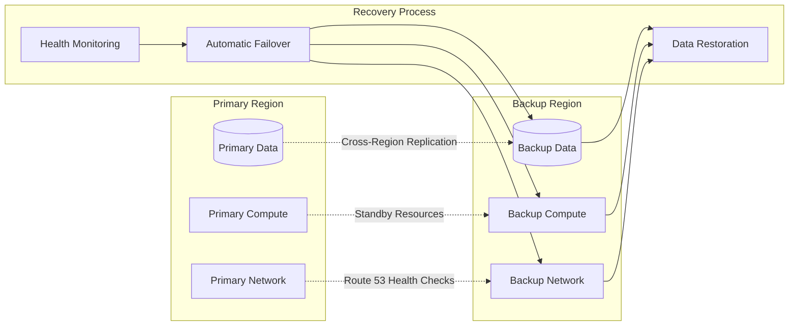

# System Architecture Overview

## High-Level Architecture

Petty is built as a serverless, event-driven system on AWS, designed for scalability, security, and real-time responsiveness.

## Core Components

### 1. Data Ingestion Pipeline

### 2. Behavioral Analysis Engine

### 3. Real-Time Communication

## Security Architecture

## Data Flow Architecture

## Deployment Architecture

## Scalability Patterns

### Auto-Scaling Strategy

### Caching Strategy

## Performance Characteristics

| Component | Latency Target | Throughput Target | Availability |
|-----------|----------------|-------------------|--------------|
| API Gateway | < 100ms | 10,000 req/s | 99.95% |
| Lambda Functions | < 500ms | 1,000 concurrent | 99.9% |
| Database Queries | < 50ms | 5,000 ops/s | 99.99% |
| Real-time Updates | < 200ms | 1,000 connections | 99.9% |
| Behavioral Analysis | < 2s | 100 analyses/min | 99.5% |

## Disaster Recovery

## Technology Stack

### Backend
- **Runtime**: Python 3.11
- **Framework**: AWS Lambda + SAM
- **Database**: AWS Timestream, DynamoDB
- **Cache**: ElastiCache (Redis)
- **Queue**: AWS SQS
- **Storage**: S3 with SSE-S3

### Frontend
- **Mobile**: Flutter/Dart
- **Web**: React.js (planned)
- **State Management**: Provider/Riverpod
- **HTTP Client**: Dio/http

### DevOps
- **CI/CD**: GitHub Actions
- **IaC**: AWS SAM + CloudFormation
- **Monitoring**: CloudWatch + X-Ray
- **Security**: CodeQL + Bandit

### AI/ML
- **Framework**: scikit-learn + custom models
- **Feature Store**: DynamoDB
- **Model Serving**: Lambda functions
- **Training**: SageMaker (future)

---

**Next**: [Data Flow Architecture](data-flow.md) | [Infrastructure Details](infrastructure.md)