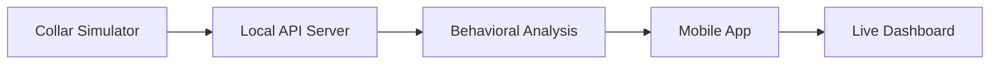

# Quick Start Guide

Get your Petty pet monitoring system up and running in under 10 minutes.

## 🎯 What You'll Accomplish

By the end of this guide, you'll have:
- ✅ A fully functional backend API
- ✅ Mobile app running on your device
- ✅ Sample pet collar data flowing through the system
- ✅ Real-time behavioral analysis working
- ✅ Alerts and timeline features operational

## 📋 Prerequisites

### Required
- **Python 3.11+** - [Download here](https://python.org/downloads)
- **Flutter 3.16+** - [Install guide](https://flutter.dev/docs/get-started/install)
- **Git** - [Install guide](https://git-scm.com/downloads)

### Optional (for cloud deployment)
- **AWS CLI** - [Install guide](https://aws.amazon.com/cli/)
- **AWS SAM CLI** - [Install guide](https://docs.aws.amazon.com/serverless-application-model/latest/developerguide/install-sam-cli.html)

### System Requirements
- **OS**: Windows 10+, macOS 12+, or Ubuntu 20.04+
- **RAM**: 8GB minimum, 16GB recommended
- **Storage**: 5GB available space
- **Network**: Stable internet connection

## 🚀 Step 1: Clone and Setup Backend (3 minutes)

### 1.1 Clone the Repository
```bash
git clone https://github.com/kakashi3lite/Petty.git
cd Petty
```

### 1.2 Create Python Environment
```bash
# Create virtual environment
python -m venv .venv

# Activate it
# On Windows:
.venv\Scripts\activate
# On macOS/Linux:
source .venv/bin/activate
```

### 1.3 Install Dependencies
```bash
# Upgrade pip and install project
pip install -U pip
pip install -e .
```

### 1.4 Validate Installation
```bash
python tests/validate_system.py
```

**Expected Output:**
```
✅ ALL VALIDATION TESTS PASSED!
🎉 Petty system is ready for production
```

## 📱 Step 2: Setup Mobile App (2 minutes)

### 2.1 Navigate to Mobile Directory
```bash
cd mobile_app
```

### 2.2 Install Flutter Dependencies
```bash
flutter pub get
```

### 2.3 Verify Flutter Setup
```bash
flutter doctor
```

**Expected Output:**
```
[✓] Flutter (Channel stable, 3.16.x)
[✓] Android toolchain - develop for Android devices
[✓] Chrome - develop for the web
[✓] Android Studio
[✓] VS Code
[✓] Connected device (1 available)
```

### 2.4 Run Mobile App
```bash
# For Android/iOS device or emulator
flutter run

# For web (development)
flutter run -d chrome
```

## 🔧 Step 3: Start Local Backend (2 minutes)

### 3.1 Return to Project Root
```bash
cd ..
```

### 3.2 Start Local API Server
```bash
# Option A: Using SAM Local (recommended)
sam local start-api --port 3000

# Option B: Using Python directly (simpler)
python -m uvicorn src.api.main:app --reload --port 3000
```

### 3.3 Verify API is Running
```bash
curl http://localhost:3000/health
```

**Expected Response:**
```json
{
  "status": "healthy",
  "version": "0.1.0",
  "timestamp": "2024-01-20T10:30:00Z"
}
```

## 🐾 Step 4: Simulate Pet Data (2 minutes)

### 4.1 Start Collar Simulator
```bash
# In a new terminal window
cd Petty
source .venv/bin/activate
python tools/collar_simulator.py --collar-id "SN-DEMO" --endpoint-url "http://localhost:3000/ingest"
```

**Expected Output:**
```
🐕 Starting Petty Collar Simulator
📡 Sending data to: http://localhost:3000/ingest
🔗 Collar ID: SN-DEMO
⏱️  Interval: 5 seconds

✅ Data sent: heart_rate=72, activity=0.45, location=[37.7749,-122.4194]
✅ Data sent: heart_rate=78, activity=0.62, location=[37.7751,-122.4196]
```

### 4.2 Verify Data Ingestion
```bash
# Check real-time data
curl "http://localhost:3000/realtime?collar_id=SN-DEMO"
```

**Expected Response:**
```json
{
  "collar_id": "SN-DEMO",
  "current_status": {
    "activity": "walking",
    "heart_rate": 75,
    "location": "nearby",
    "last_seen": "2024-01-20T10:29:45Z"
  },
  "health_score": 0.87,
  "alerts": [],
  "last_updated": "2024-01-20T10:30:00Z"
}
```

## 📊 Step 5: View Live Dashboard (1 minute)

### 5.1 Configure Mobile App
1. Open the mobile app (should be running from Step 2)
2. Navigate to **Settings** → **API Configuration**
3. Set API Base URL to: `http://localhost:3000` (or your computer's IP for physical device)
4. Set Collar ID to: `SN-DEMO`
5. Tap **Save & Connect**

### 5.2 Explore Features
1. **Dashboard**: View real-time activity and health metrics
2. **Timeline**: See behavioral events and patterns
3. **Pet Profile**: View care recommendations
4. **Alerts**: Check for any health or activity alerts

## 🎉 Success! You're Now Running Petty

Congratulations! You now have a fully functional pet monitoring system. Here's what's happening:



## 🧪 Test Key Features

### Test Behavioral Analysis
```bash
# Generate a play session
curl -X POST http://localhost:3000/ingest \
  -H "Content-Type: application/json" \
  -d '{
    "collar_id": "SN-DEMO",
    "timestamp": "2024-01-20T10:30:00Z",
    "heart_rate": 120,
    "activity_level": 0.9,
    "location": {"latitude": 37.7749, "longitude": -122.4194}
  }'
```

### Test Timeline Retrieval
```bash
curl "http://localhost:3000/pet-timeline?collar_id=SN-DEMO&limit=10"
```

### Test Feedback Submission
```bash
curl -X POST http://localhost:3000/submit-feedback \
  -H "Content-Type: application/json" \
  -d '{
    "event_id": "evt_generated_id",
    "user_feedback": "correct",
    "confidence": 0.95
  }'
```

## 🛠️ Common Issues & Solutions

### Backend Issues

**Issue**: `ModuleNotFoundError: No module named 'petty'`
```bash
# Solution: Reinstall in development mode
pip install -e .
```

**Issue**: `Port 3000 already in use`
```bash
# Solution: Use a different port
sam local start-api --port 3001
# Or kill the process using port 3000
lsof -ti:3000 | xargs kill -9
```

**Issue**: `Permission denied` on Windows
```bash
# Solution: Run as administrator or use PowerShell
```

### Mobile App Issues

**Issue**: `Flutter not found`
```bash
# Solution: Add Flutter to PATH
export PATH="$PATH:/path/to/flutter/bin"
```

**Issue**: `No devices available`
```bash
# Solution: Start an emulator or enable USB debugging
flutter emulators --launch <emulator_id>
```

**Issue**: `Network connection failed`
- For Android emulator: Use `http://10.0.2.2:3000`
- For iOS simulator: Use `http://localhost:3000`
- For physical device: Use your computer's IP address

### Data Flow Issues

**Issue**: `No data appearing in timeline`
```bash
# Solution: Check if simulator is running and API is receiving data
curl http://localhost:3000/health
python tools/collar_simulator.py --help
```

## 🚀 Next Steps

### Explore Advanced Features
1. **[Real-time Alerts](../features/real-time-alerts.md)** - Set up custom alert rules
2. **[Behavioral Analysis](../features/behavioral-analysis.md)** - Deep dive into AI insights
3. **[Data Export](../integration/data-migration.md)** - Export your pet's data

### Deploy to Production
1. **[AWS Deployment](../deployment/aws-deployment.md)** - Deploy to AWS cloud
2. **[Environment Configuration](../deployment/environment-config.md)** - Configure for production
3. **[Monitoring Setup](../operations/monitoring.md)** - Set up production monitoring

### Customize Your Setup
1. **[Configuration Guide](../reference/configuration.md)** - Customize system behavior
2. **[Integration Guide](../integration/README.md)** - Connect with other services
3. **[Development Guide](../guides/development-setup.md)** - Set up for development

## 📚 Additional Resources

### Documentation
- **[API Reference](../api/README.md)** - Complete API documentation
- **[Architecture Overview](../architecture/system-overview.md)** - System architecture details
- **[Security Guide](../SECURITY.md)** - Security implementation details

### Community
- **[GitHub Issues](https://github.com/kakashi3lite/Petty/issues)** - Report bugs or request features
- **[Discussions](https://github.com/kakashi3lite/Petty/discussions)** - Community discussions
- **[Contributing Guide](../meta/contributing.md)** - How to contribute

### Support
- **[Troubleshooting Guide](../troubleshooting/README.md)** - Detailed troubleshooting
- **[FAQ](../troubleshooting/faq.md)** - Frequently asked questions
- **Email Support**: support@petty.ai

---

**🎊 Welcome to the Petty Community!** 

You've successfully set up your pet monitoring system. Start exploring the rich behavioral insights and real-time monitoring capabilities that Petty provides.

**Estimated Total Time**: 8-10 minutes | **Difficulty**: Beginner | **Last Updated**: January 20, 2024